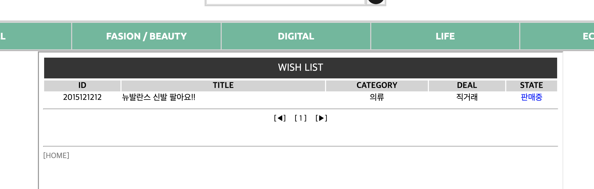

# Web programming Project

Detailed descriptions on implemented functions

1. Administrateor

  1) Users list
  
  2) Writes list
  
  3) Messages list
  
2. Seller

  1) Product registration
  
  2) Product Info
  
  3) Product edit

3. Buyer

  1) Product list
  
  2) Product buy
  
  3) Wish list
  
  4) Search
  
  5) Shopping list
  
4. Common page

  1) Login page
  
  2) Registration page
  
  3) Product page
  
  4) My page
  
5. Database

--- Picture ---

main page

  
    
  --------
  
  

1. Administrateor

  1) Users list
  
  

  2) Writes list
  
  
  
  3) Messages list
  
  

2. Seller

  1) Product registration
  
  
  
  2) Product Info
  
  
    
  --------
  
  
  
  3) Product edit
  
  
  
3. Buyer

  1) Product list
  
  

  2) Product buy
  
  
  
  --------
  
  
  
  3) Wish list
  
  
  
  4) Search
  
  

  5) Shopping list
  
  

4. Common page

  1) Login page
  
  
    
  --------
  
  

  2) Registration page
  
  

  3) Product page
  
  
    
  --------
  
  

  4) My page
  
  
    
  --------
  
  

5. Database

CREATE TABLE `admin` (
  `outoID` int(11) NOT NULL,
  `adminid` varchar(40) DEFAULT NULL,
  `adminpass` int(20) DEFAULT NULL
) ENGINE=InnoDB DEFAULT CHARSET=utf8;

INSERT INTO `admin` (`outoID`, `adminid`, `adminpass`) VALUES
(1, 'admin', 123123);

CREATE TABLE `messages` (
  `outoID` int(11) NOT NULL,
  `mfrom` varchar(40) DEFAULT NULL,
  `mto` varchar(40) DEFAULT NULL,
  `messages` varchar(100) DEFAULT NULL,
  `mode` varchar(11) DEFAULT NULL,
  `date` varchar(30) DEFAULT NULL,
  `deletenum` int(11) DEFAULT NULL
) ENGINE=InnoDB DEFAULT CHARSET=utf8;

CREATE TABLE `users` (
  `outoID` int(11) NOT NULL,
  `id` varchar(40) DEFAULT NULL,
  `pass` varchar(40) DEFAULT NULL,
  `name` varchar(40) DEFAULT NULL,
  `email` varchar(40) DEFAULT NULL,
  `gender` varchar(10) DEFAULT NULL,
  `hp` varchar(20) DEFAULT NULL,
  `adress` varchar(100) DEFAULT NULL
) ENGINE=InnoDB DEFAULT CHARSET=utf8;

CREATE TABLE `wishlist` (
  `outoID` int(11) NOT NULL,
  `id` varchar(40) NOT NULL,
  `product_num` int(11) NOT NULL,
  `product_subject` varchar(50) NOT NULL,
  `product_category` varchar(20) NOT NULL,
  `product_deal` varchar(10) NOT NULL,
  `sell_name` varchar(20) NOT NULL,
  `soldout` tinyint(1) DEFAULT NULL
) ENGINE=InnoDB DEFAULT CHARSET=utf8;

CREATE TABLE `writes` (
  `outoID` int(11) NOT NULL,
  `id` varchar(40) NOT NULL,
  `subject` varchar(50) NOT NULL,
  `category` varchar(20) NOT NULL,
  `deal` varchar(10) DEFAULT NULL,
  `price` int(20) DEFAULT NULL,
  `content` text NOT NULL,
  `imgname` varchar(100) DEFAULT NULL,
  `data` mediumblob,
  `soldout` int(11) DEFAULT NULL
) ENGINE=InnoDB DEFAULT CHARSET=utf8;

